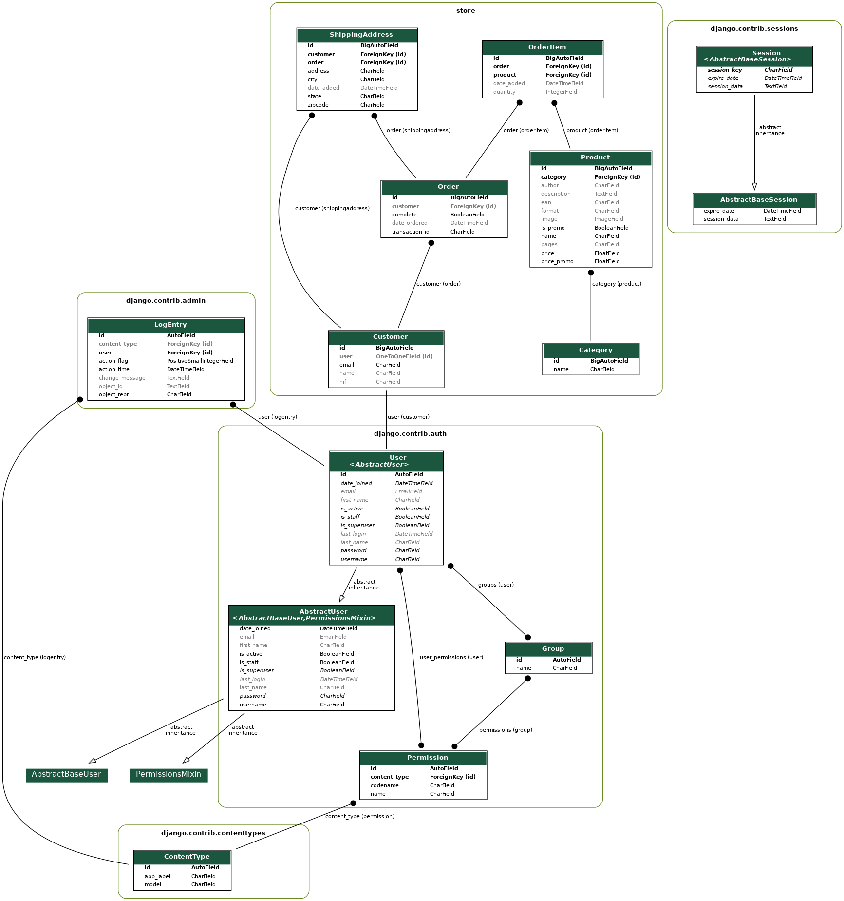

# 🏮 NIPPONIME - E-commerce de Mangás

[](https://www.djangoproject.com/)
[](https://www.python.org/)
[](https://opensource.org/licenses/MIT)

> **Projeto de Conclusão de Curso (PAP) - 12º Ano**  
> **Nota Final: 20 valores** 🎓  
> **Primeiro projeto em Python e Django**

## 📋 Sobre o Projeto

**NIPPONIME** é uma plataforma de e-commerce especializada na venda de mangás, desenvolvida como Projeto de Aptidão Profissional (PAP) do 12º ano. Este foi o meu primeiro contacto com Python e Django, representando uma jornada de aprendizagem completa no desenvolvimento web.

### 🎯 Objetivos do Projeto

-   Criar uma loja online funcional para venda de mangás
-   Implementar sistema de utilizadores e autenticação
-   Desenvolver carrinho de compras e sistema de favoritos
-   Criar painel administrativo para gestão de produtos
-   Aplicar boas práticas de desenvolvimento web

## ✨ Funcionalidades

### 🛒 **E-commerce Completo**

-   Catálogo de produtos com categorias e tags
-   Sistema de promoções com datas de início e fim
-   Carrinho de compras (utilizadores registados e convidados)
-   Processo de checkout e gestão de encomendas
-   Sistema de favoritos

### 👤 **Gestão de Utilizadores**

-   Registo e autenticação de utilizadores
-   Perfis de cliente personalizados
-   Histórico de compras
-   Sistema de mensagens internas

### 🎨 **Interface e Experiência**

-   Design responsivo com Bootstrap
-   Carrossel de produtos em destaque
-   Sistema de paginação
-   Funcionalidade de pesquisa
-   Navegação por categorias

### ⚙️ **Administração**

-   Painel admin Django personalizado
-   Gestão de produtos, categorias e utilizadores
-   Controlo de encomendas e estados
-   Sistema de mensagens para clientes

## 🏗️ Arquitetura do Projeto

### **Modelos Principais**

-   **Product**: Gestão de mangás com preços, promoções e metadados
-   **Customer**: Perfis de clientes ligados ao sistema de auth do Django
-   **Order & OrderItem**: Sistema de encomendas e itens
-   **Category & Tag**: Organização e classificação de produtos
-   **ShippingAddress**: Endereços de entrega
-   **Msg**: Sistema de mensagens internas

### **Estrutura de Ficheiros**

```
nipponime_final/
├── nipponime/          # Configurações principais do Django
├── store/              # App principal da loja
│   ├── models.py       # Modelos de dados
│   ├── views.py        # Lógica de negócio
│   ├── urls.py         # Rotas da aplicação
│   ├── forms.py        # Formulários
│   ├── admin.py        # Configuração do admin
│   └── templates/      # Templates HTML
├── static/             # Ficheiros estáticos (CSS, JS, imagens)
├── requirements.txt    # Dependências do projeto
└── manage.py          # Gestão do Django
```

## 🚀 Instalação e Configuração

### **Pré-requisitos**

-   Python 3.9+
-   pip (gestor de pacotes Python)

### **1. Clonar o Repositório**

```bash
git clone https://github.com/promac3k/nipponime_final.git
cd nipponime_final
```

### **2. Criar Ambiente Virtual**

```bash
python -m venv venv
source venv/bin/activate  # Linux/Mac
# ou
venv\Scripts\activate     # Windows
```

### **3. Instalar Dependências**

```bash
pip install -r requirements.txt
```

### **4. Configurar Variáveis de Ambiente**

```bash
# Copiar o ficheiro de exemplo
cp .env.example .env

# Editar o ficheiro .env com as suas configurações
```

### **5. Configurar Base de Dados**

```bash
python manage.py makemigrations
python manage.py migrate
```

### **6. Criar Superutilizador**

```bash
python manage.py createsuperuser
```

### **7. Executar o Servidor**

```bash
python manage.py runserver
```

Aceda a `http://127.0.0.1:8000` para ver a aplicação.

## 🔧 Configuração de Produção

### **Variáveis de Ambiente Necessárias**

```env
SECRET_KEY=sua-chave-secreta-aqui
DEBUG=False
ALLOWED_HOSTS=seudominio.com
EMAIL_HOST_USER=seu-email@gmail.com
EMAIL_HOST_PASSWORD=sua-app-password
```

### **Segurança**

-   ✅ SECRET_KEY configurada via ambiente
-   ✅ DEBUG desativado em produção
-   ✅ ALLOWED_HOSTS restritivo
-   ✅ Credenciais de email protegidas

## 📊 Diagrama de Modelos



Para gerar um novo diagrama:

```bash
python manage.py graph_models -a -g -o modelos.png
```

## 🛠️ Tecnologias Utilizadas

### **Backend**

-   **Django 3.2.16** - Framework web principal
-   **SQLite** - Base de dados (desenvolvimento)
-   **Pillow** - Processamento de imagens

### **Frontend**

-   **Bootstrap 4** - Framework CSS
-   **JavaScript** - Interatividade (carrinho, favoritos)
-   **Ion Icons** - Iconografia

### **Ferramentas**

-   **django-crispy-forms** - Formulários elegantes
-   **django-extensions** - Ferramentas adicionais de desenvolvimento

## 📈 Aprendizagens e Desafios

### **Primeira Experiência com Python/Django**

Este projeto representou o meu primeiro contacto sério com Python e Django. Os principais desafios enfrentados foram:

-   **Compreender o padrão MVT** (Model-View-Template) do Django
-   **Gestão de relações entre modelos** (ForeignKey, ManyToMany)
-   **Sistema de autenticação** e permissões
-   **AJAX e JavaScript** para funcionalidades dinâmicas
-   **Deployment e configurações de produção**

### **Conquistas**

-   ✅ Sistema de e-commerce funcional e completo
-   ✅ Interface limpa e responsiva
-   ✅ Código organizado e documentado
-   ✅ Nota máxima (20 valores) no PAP
-   ✅ Base sólida para futuros projetos Django

## 🤝 Contribuições

Este projeto foi desenvolvido como PAP individual, mas sugestões e melhorias são sempre bem-vindas!

### **Como Contribuir**

1. Fork o projeto
2. Crie uma branch para sua feature (`git checkout -b feature/AmazingFeature`)
3. Commit suas mudanças (`git commit -m 'Add some AmazingFeature'`)
4. Push para a branch (`git push origin feature/AmazingFeature`)
5. Abra um Pull Request

## 📝 Licença

Este projeto está sob a licença MIT. Veja o ficheiro `LICENSE` para mais detalhes.

## 👨‍💻 Autor

**Gustavo Antunes**

-   🎓 Projeto de Aptidão Profissional - 12º Ano (2023)
-   📧 Email: [seu-email@exemplo.com]
-   🔗 LinkedIn: [seu-linkedin]
-   🐙 GitHub: [@promac3k](https://github.com/promac3k)

---

> _"Este projeto marca o início da minha jornada no desenvolvimento web com Python e Django. Representou não apenas uma avaliação académica, mas o primeiro passo numa paixão que continua a crescer."_

## 🙏 Agradecimentos

-   Aos professores que me orientaram durante o desenvolvimento
-   À comunidade Django pela excelente documentação
-   A todos que testaram e deram feedback sobre a aplicação

---

⭐ **Se este projeto te foi útil, considera dar uma estrela!** ⭐
